# Crystal Clear Comments 🔮

A VSCode Marketplace published extension designed to help developers gain insights into the quality & quantity of comments in their code. This extension analyzes comments in C, C++, Python, JavaScript and Java files, providing metrics & visualizations to enhance code documentation practices.

## Demonstration Video

<a href="https://youtu.be/gSlA7xRId1c">
    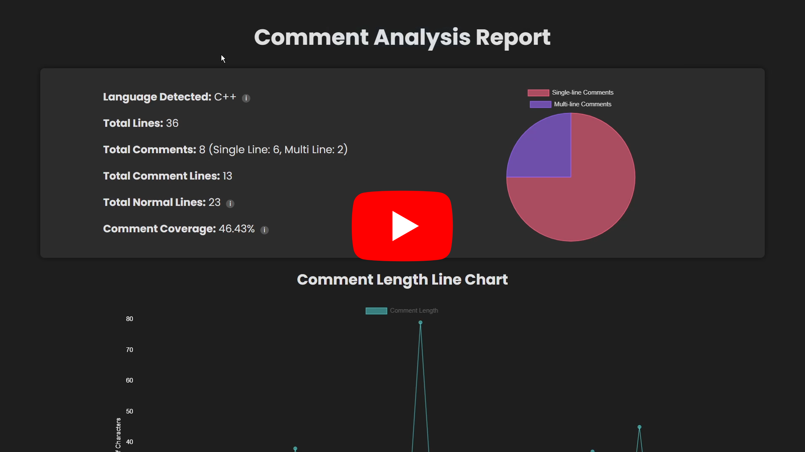
</a>

## Extension Links

- [VSCode Marketplace](https://marketplace.visualstudio.com/items?itemName=HardikPawar.crystal-clear-comments)
- [GitHub Repository](https://github.com/Hardvan/crystal-clear-comments.git)

## Features

- **Comment Coverage Analysis**: Calculates the percentage of lines that are comments out of the total non-blank lines.
- **Language Detection**: Automatically detects the programming language (C, C++, Python, JavaScript, Java) and tailors the analysis accordingly.
- **Detailed Comment Breakdown**: Provides a breakdown of single-line and multi-line comments, and their distribution visualized in a pie chart.
- **Comment Length Analysis**: Analyzes the length of comments and visualizes it over the range of lines in the file as a line chart.
- **Word Cloud Generation**: Generates a word cloud of the most frequently used words in the comments, with the size of the word indicating its frequency.
- **Interactive Report Generation**: Generates an HTML report with charts and tables summarizing the comment analysis.

## How to Use the Extension (for Users)

1. Open a C, C++, Python, JavaScript, or Java file in VSCode.

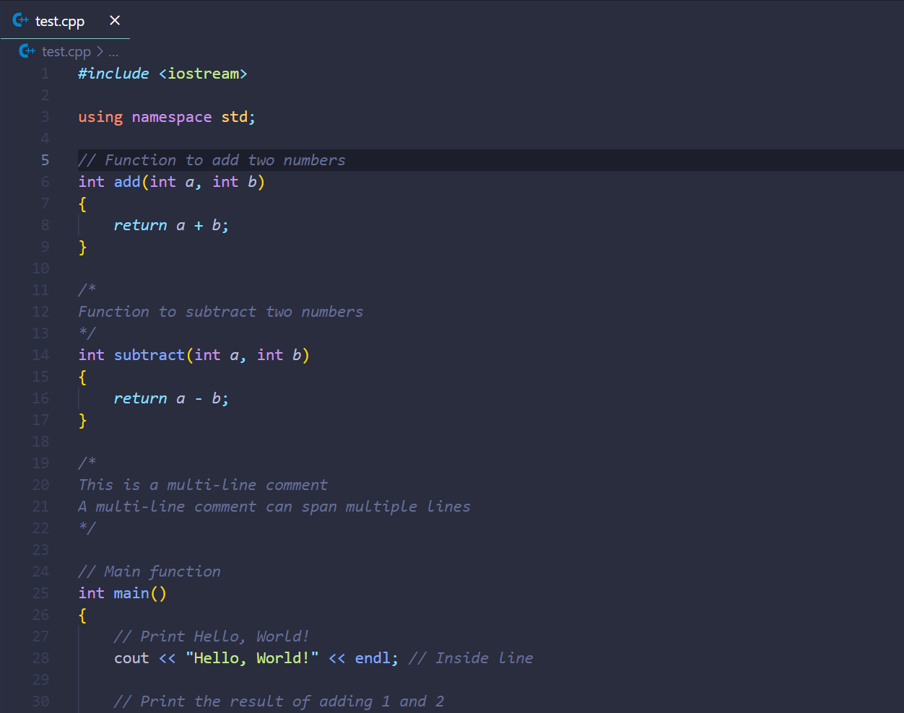

2. Press `Ctrl+Shift+P` to open the command palette.

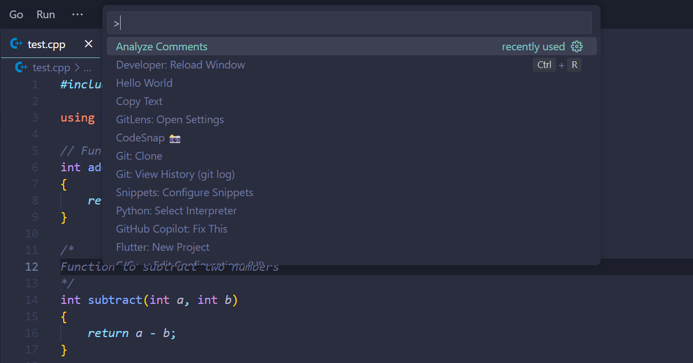

3. Type `Analyze Comments` and select the command to start the analysis.

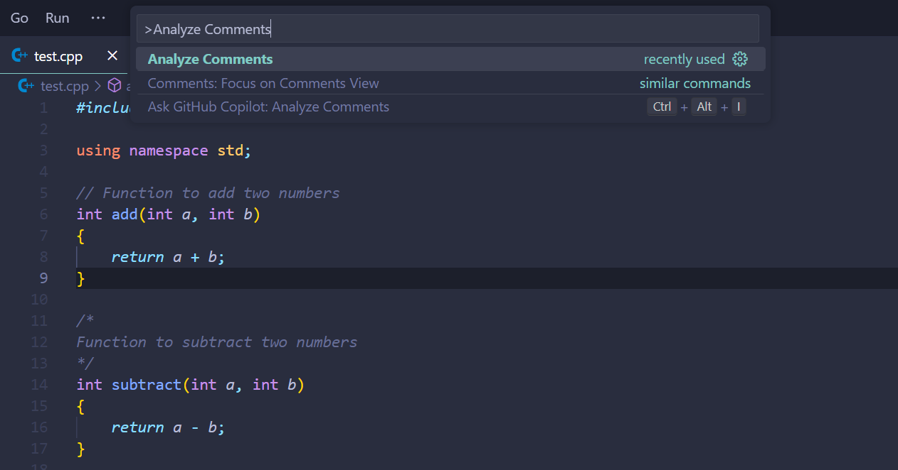

4. The extension will analyze the comments in the current file and generate a report in a new HTML file.

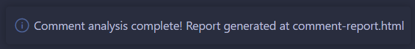

5. Open the HTML file to view the detailed analysis of comments in the file.

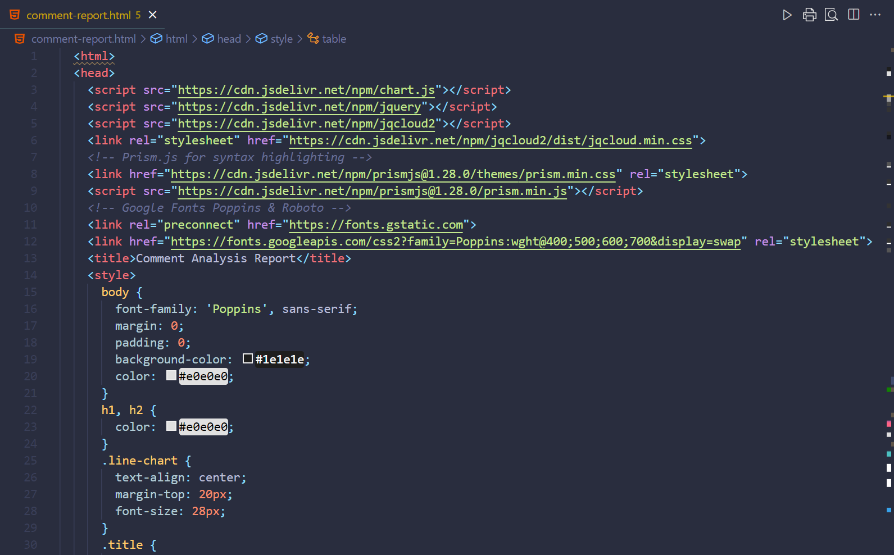

## Example Report

The extension generates an HTML report with the following sections:

- **Comment Coverage Analysis**: Displays the percentage of comment lines, total comments, and total lines in the file.
- **Charts**:
  - _Comment Types Distribution_: A pie chart showing the distribution of single-line and multi-line comments.
  - _Comment Length_: A line chart showing the length of comments across the file's lines.
- **Word Cloud**: A visual representation of the most frequent words found in comments.
- **Comment Details**: A table listing each comment, its type (single-line or multi-line), and its location in the code.
- **Input File Code Snippet**: A code snippet of the input file with a copy-to-clipboard button.

Screenshots of the generated report:

  
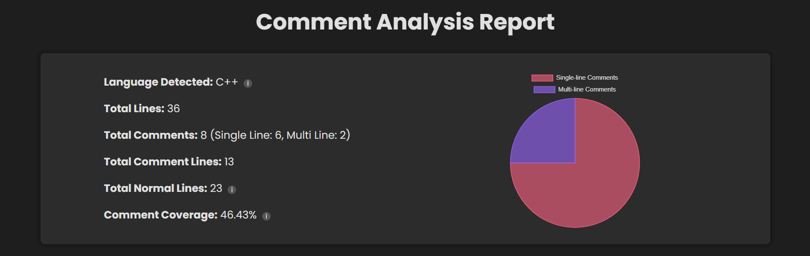
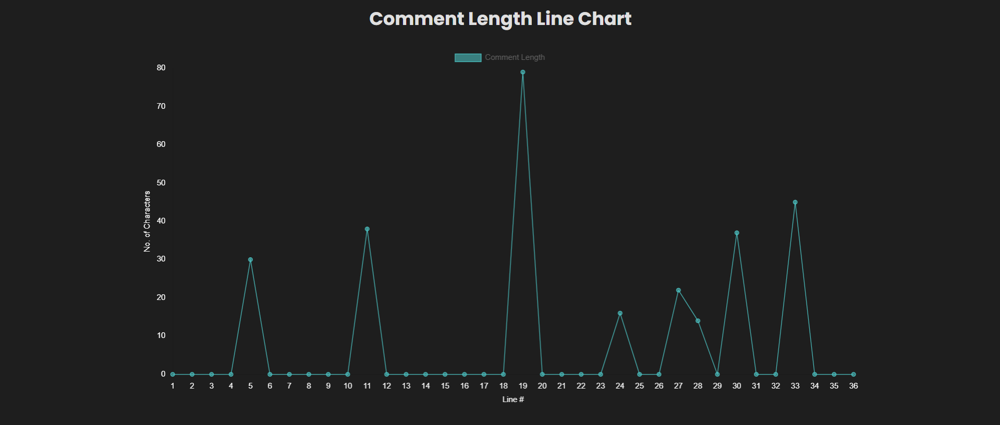
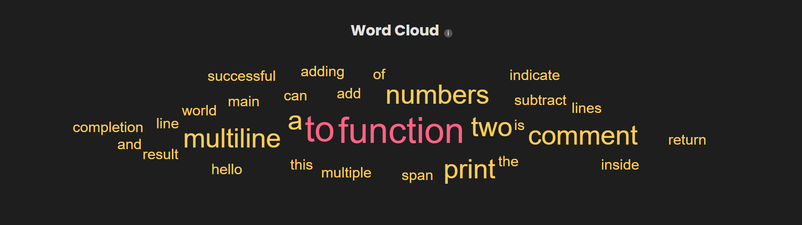
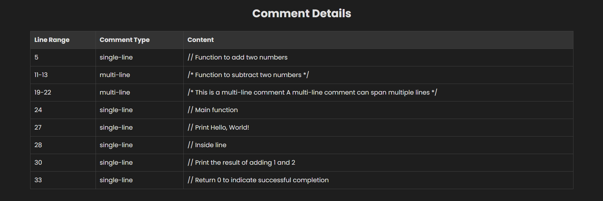
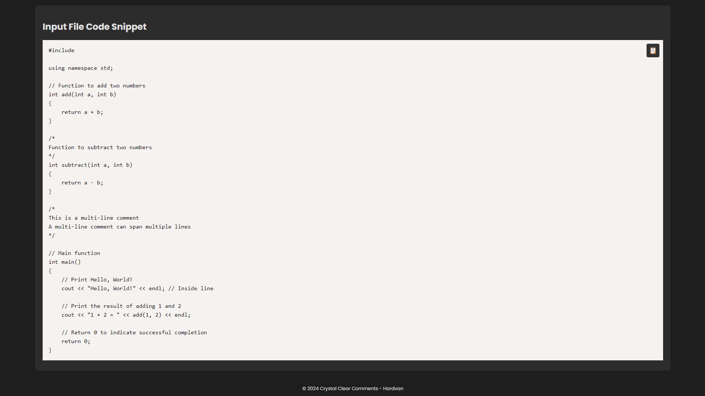

## Installation (for Dev/Contributors)

1. Clone this repository to your local machine.
2. Open the project in VSCode.
3. Press `F5` to start debugging the extension.
4. The extension will launch in a new VSCode window where you can test its functionality.

## Contributing

Contributions are welcome! Please follow these steps:

1. Fork this repository.
2. Clone your forked repository to your local machine.
3. Create a new branch for your feature or bugfix.
4. Make your changes & commit them with descriptive messages.
5. Submit a pull request/merge request.

## To Update the Project

1. Make the necessary changes.
2. Update the version number in the `package.json` file.
3. Run `vsce package` to create a new `.vsix` file.
4. Publish the new version to the VSCode Marketplace using the `vsce publish` command.

**Crystal Clear Comments** is designed to give developers clear insights into their code documentation, making it easier to maintain and understand codebases over time. Enjoy coding with crystal-clear clarity!
